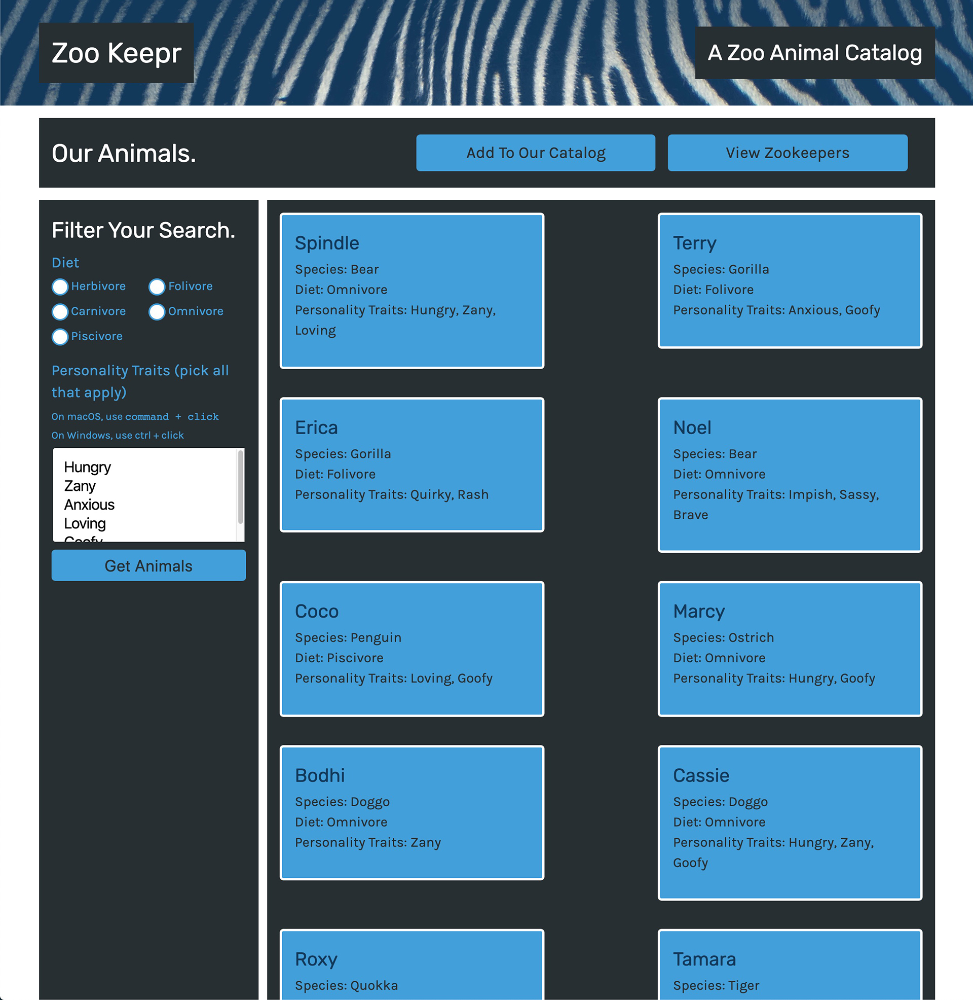

# Zookeepr

This program demonstrates a web server using the Express.js framework and adds it to a front-end application called Zoo Keepr. The site’s data will go live on the server you build so that anyone can access it without having to download it

## Built With

- Heroku
- node.js
- JavaScript

## Deployment

https://rocky-badlands-81041.herokuapp.com/

## Mock-up

## Contribution:

Erik Williams
