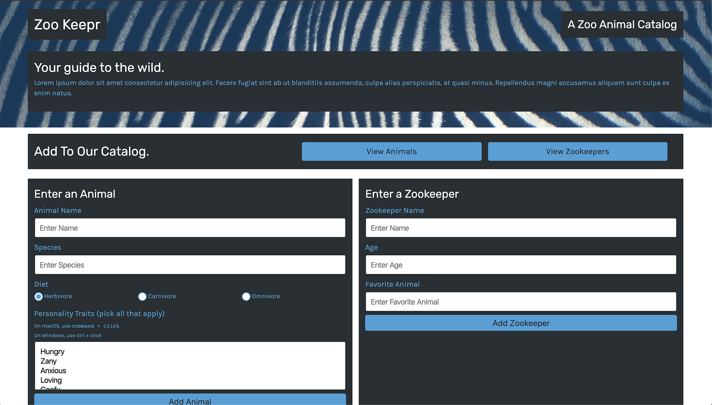
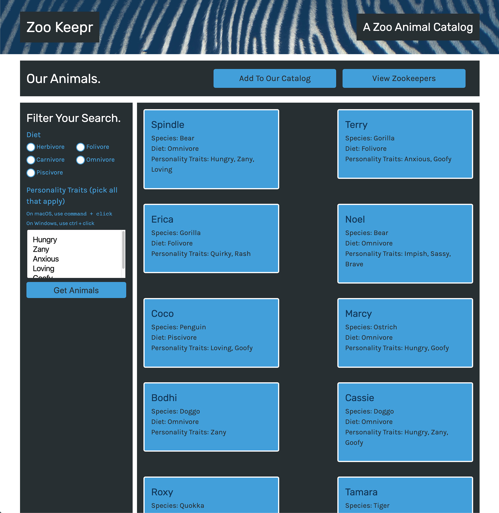

# Zookeepr

## Purpose
This program demonstrates a web server using the Express.js framework and adds it to a front-end application called Zoo Keepr. The site’s data will go live on the server you build so that anyone can access it without having to download it. This application will also be deployed to Heroku, a cloud application platform that allows you to deploy applications with servers to a webpage.

## Built With
* Heroku
* node.js
* JavaScript

## Website
https://github.com/EPW80/Zookeepr

## Deployment
https://epw80.github.io/Zookeepr/

## Heroku Deploy
https://rocky-badlands-81041.herokuapp.com/

## Mock-up

## Challenges 

## Test
none

## Questions
for more information or if you have a question: email [erikpw009@gmail.com](erikpw009@gmail.com).

## Contribution:
Erik Williams

## License

#### ©️2022 EPW